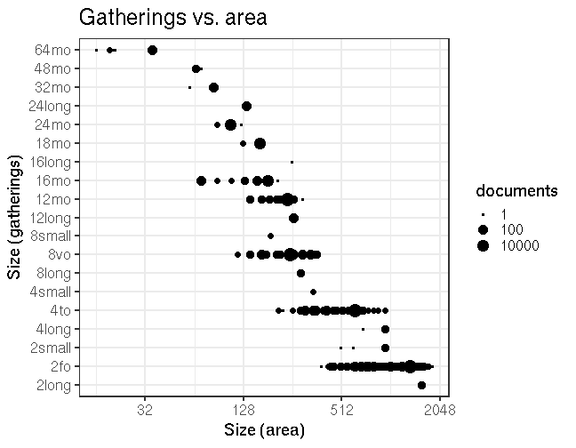

## Document size comparisons

  * Some dimension info is provided in the original raw data for altogether 472315 documents (97.8%) but could not be interpreted for 3624 documents (ie. dimension info was successfully estimated for 99.2 % of the documents where this field was not empty).

  * Document size (area) info was obtained in the final preprocessed data for altogether 471619 documents (98%). For the remaining documents, critical dimension information was not available or could not be interpreted: [List of entries where document surface area could not be estimated](output.tables/physical_dimension_incomplete.csv)

  * Document gatherings info is originally available for 465373 documents (96%), and further estimated up to 468691 documents (97%) in the final preprocessed data.

  * Document height info is originally available for 8471 documents (2%), and further estimated up to 471619 documents (98%) in the final preprocessed data.

  * Document width info is originally available for 3799 documents (1%), and further estimated up to 471619 documents (98%) in the final preprocessed data.


These tables can be used to verify the accuracy of the conversions from the raw data to final estimates:

  * [Dimension conversions from raw data to final estimates](output.tables/conversions_physical_dimension.csv)

  * [Automated tests for dimension conversions](https://github.com/COMHIS/bibliographica/blob/master/inst/extdata/tests_dimension_polish.csv)


The estimated dimensions are based on the following auxiliary information sheets:

  * [Document dimension abbreviations](https://github.com/COMHIS/bibliographica/blob/master/inst/extdata/document_size_abbreviations.csv)

  * [Standard sheet size estimates](https://github.com/COMHIS/bibliographica/blob/master/inst/extdata/sheetsizes.csv)

  * [Document dimension estimates](https://github.com/COMHIS/bibliographica/blob/master/inst/extdata/documentdimensions.csv) (used when information is partially missing)

  * [Discarded entries (curated)](rejected_entries_curated.csv); these entries have been curated, and confirmed to contain no interpretable dimension information. These are discarded before other processing.

  * [Discarded entries (non-curated)](rejected_entries_noncurated.csv); these entries have not been curated, and they could not be interpreted for dimension information. 


Left: final gatherings vs. final document dimension (width x height). Right: original gatherings versus original heights where both are available. The point size indicates the number of documents for each case. The red dots indicate the estimated height that is used when only gathering information is available. 




Left: Document dimension histogram (surface area);
Right: title count per gatherings.


<!--

### Gatherings timelines


Popularity of different document sizes over time. Left: absolute title
counts. Right: relative title counts. Gatherings with less than `r
nmin` documents at every decade are excluded:


```
## Error in `$<-.data.frame`(`*tmp*`, publication_time, value = numeric(0)): replacement has 0 rows, data has 468691
```

```
## Error in print(res$plot): object 'res' not found
```

```
## Error in `$<-.data.frame`(`*tmp*`, "publication_time", value = numeric(0)): replacement has 0 rows, data has 468691
```

```
## Error in print(res$plot): object 'res' not found
```


## Average document dimensions 

Here we use the original data only:


```
## Error: Can't subset columns that don't exist.
## ✖ The column `publication_decade` doesn't exist.
```

```
## Error: Column `publication_decade` is unknown
```

```
## Error in FUN(X[[i]], ...): object 'publication_decade' not found
```


Only the most frequently occurring gatherings are listed here:


|gatherings.original | mean.width| median.width| mean.height| median.height|   n|
|:-------------------|----------:|------------:|-----------:|-------------:|---:|
|1to                 |      29.06|        29.06|       41.97|         41.97|  29|
|2fo                 |      27.62|        27.62|       36.55|         36.55| 838|
|4to                 |      23.83|        23.83|       21.67|         21.67| 540|
|8vo                 |      22.00|        22.00|       19.22|         19.22| 683|
|12mo                |      13.50|        13.50|       15.49|         15.49| 110|
|16mo                |      13.00|        13.00|       10.96|         10.96|  23|
|18mo                |      10.00|        10.00|       11.40|         11.40|   5|

-->
